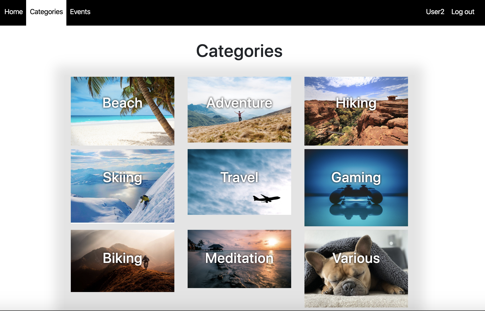
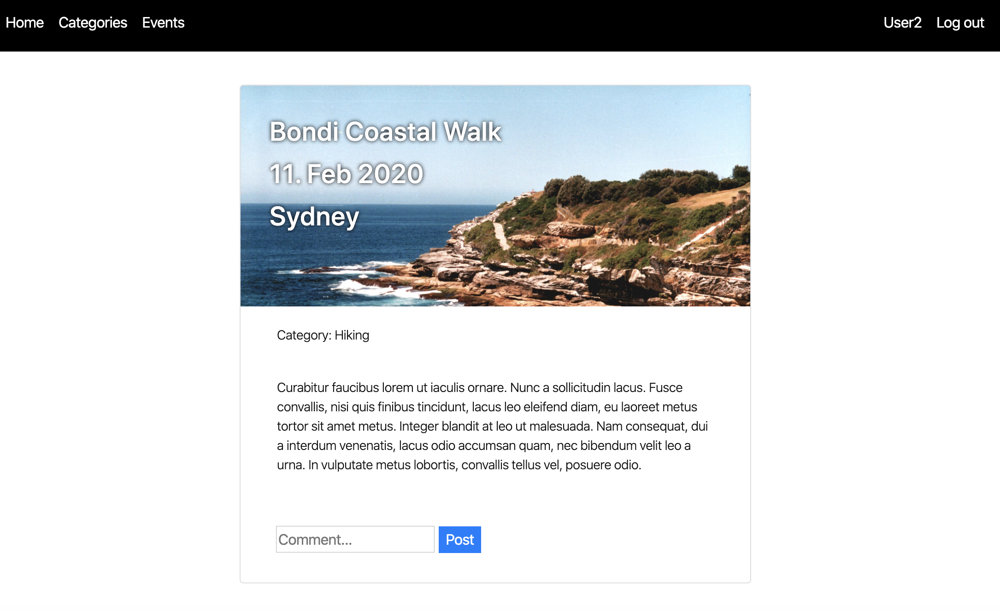
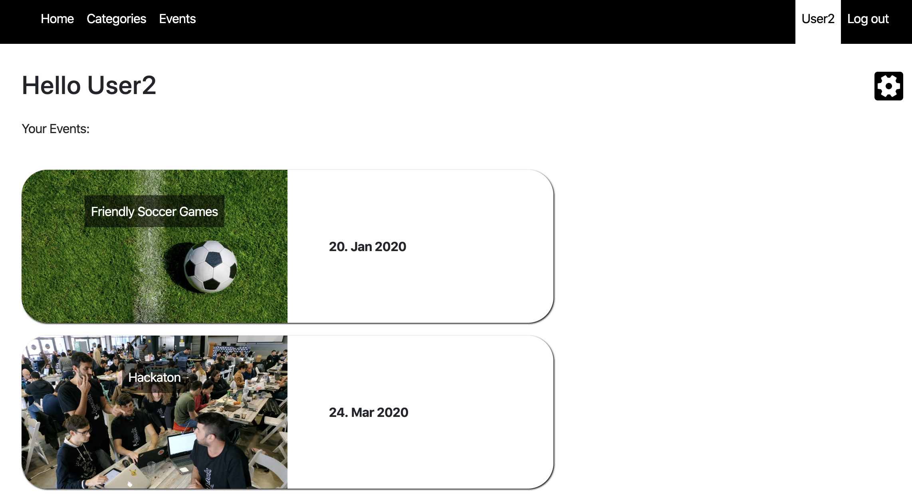

# Event Planner App - Under Construction

## Important Note
**The website is still under construction and only the basic functionalities to create a new event and searching by category is available at the moment!**

## Link
- Link to Github Page [Github Event Planner](https://github.com/androi7/eventplanner) 
- Link to Heroku Page [Heroku Event Planner](https://heroku-rails-event.herokuapp.com)

## Screenshots

## Functionalities
1. It is mandatory to create an own account.
2. The user profile shows a timeline of all attending events.
3. Each user is allowed to create new events and to join to each event.
4. Only members of an event have access to the comment part to communicate with each other.
5. The only implemented search filter so far can be found under category.

## Bugs
- When the user creates a new event, then it's not automatically showing that the creator of the event is member of it until page is refreshed.
